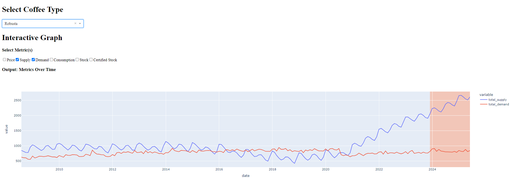
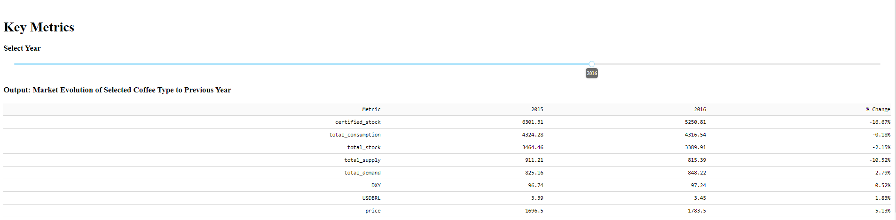

# Coffee Research
 A project done for LDC. Researching market trends and provided a forecast. 

## Contents
*analysis-final.ipynb*: Main submission file. Results will be in here. 
*analysis-forecast-draft.ipynb* and *analysis-dashboard-draft.ipynb*: Files used for drafting up the final submission. These files were more of a sketchpad for me to test ideas and are mostly uncommented. 
*requirements.txt*: Requirements file for reproducing the code. Note that I used conda for this exercise. 

## Example Dashboard Output
Visualizations were made with Dash. Running the dashboard codechunk in *analysis-final.ipynb* will lead you to a web GUI that looks like this:

